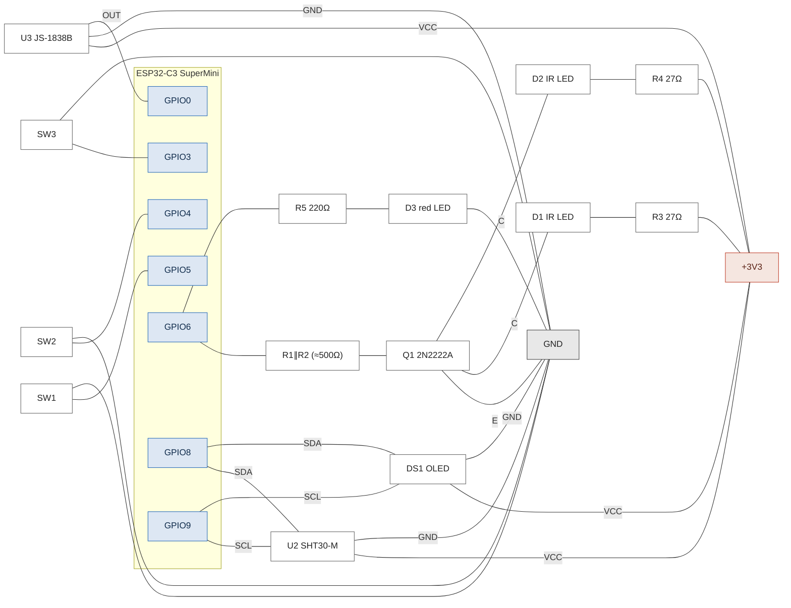

# Hardware

ESP32-C3 SuperMini-based IR remote with 3 buttons, an OLED display, and an
SHT30 temperature/humidity sensor. The board listens for incoming IR codes during installation
on GPIO0 and detect and stores the AC protocal.
After setup it uses two IR LEDs driven by an NPN transistor on GPIO6 for communication with the ACs.

## Bill of materials

| Ref     | Qty | Part                       | Notes                              |
|---------|----:|----------------------------|------------------------------------|
| U1      |   1 | ESP32-C3 SuperMini         | MCU board, 3V3 logic               |
| U2      |   1 | SHT30-M                    | I²C temp/humidity sensor           |
| DS1     |   1 | 0.96" OLED 128×64 (SSD1306)| I²C, model D096-12864-I2C-GV-WH    |
| Q1      |   1 | 2N2222A                    | NPN, low-side IR-LED driver        |
| D1, D2  |   2 | IRE940-5                   | IR LED, 940 nm                     |
| D3      |   1 | LED 5 mm red               | Status LED                         |
| U3      |   1 | JS-1838B (VS1838B)         | IR receiver, 38 kHz                |
| SW1–SW3 |   3 | TACTR-12×12×7.5            | Tactile button                     |
| R1, R2  |   2 | 1 kΩ ±5%                   | In parallel → ≈500 Ω base resistor |
| R3, R4  |   2 | 27 Ω ±5%                   | IR LED current limit (one per LED) |
| R5      |   1 | 220 Ω ±10%                 | Status LED current limit           |

## Pin assignments

| Pin    | Net      | Connection                      |
|--------|----------|---------------------------------|
| 3V3    | +3V3     | U2 VCC, U3 VCC, DS1 VCC, IR LED anodes (via R3/R4) |
| GND    | GND      | common ground                   |
| GPIO0  | IR_RX    | U3 OUT                          |
| GPIO3  | BTN3     | SW3 → GND (`INPUT_PULLUP`)      |
| GPIO4  | BTN2     | SW2 → GND (`INPUT_PULLUP`)      |
| GPIO5  | BTN1     | SW1 → GND (`INPUT_PULLUP`)      |
| GPIO6  | IR_TX    | Q1 base via R1∥R2; D3 via R5    |
| GPIO8  | I²C SDA  | U2 SDA, DS1 SDA                 |
| GPIO9  | I²C SCL  | U2 SCL, DS1 SCL                 |

## Schematic

## Notes

- **I²C pull-ups.** Both the SHT30-M and the OLED breakout boards include
  built-in pull-ups on SDA/SCL. With both connected, the effective pull-up
  is the parallel combination — fine for 100 kHz and 400 kHz operation.
  No external resistors needed.
- **GPIO9 is a boot strap pin** on the ESP32-C3. The I²C pull-up on SCL
  keeps it high at boot, which is what the chip wants. Don't add anything
  that pulls GPIO9 low at startup.
- **Status LED tracks IR transmission.** R5 + D3 hang off the same GPIO6
  that drives the transistor base, so the red LED flickers visibly on
  every IR burst.
- **IR LED current.** With V_LED ≈ 1.4 V, V_CE(sat) ≈ 0.2 V, and 27 Ω in
  series, peak current per LED is ≈ 63 mA. IR remote protocols pulse at
  ~33% duty over short bursts, keeping the average well within the LED's
  continuous rating.
